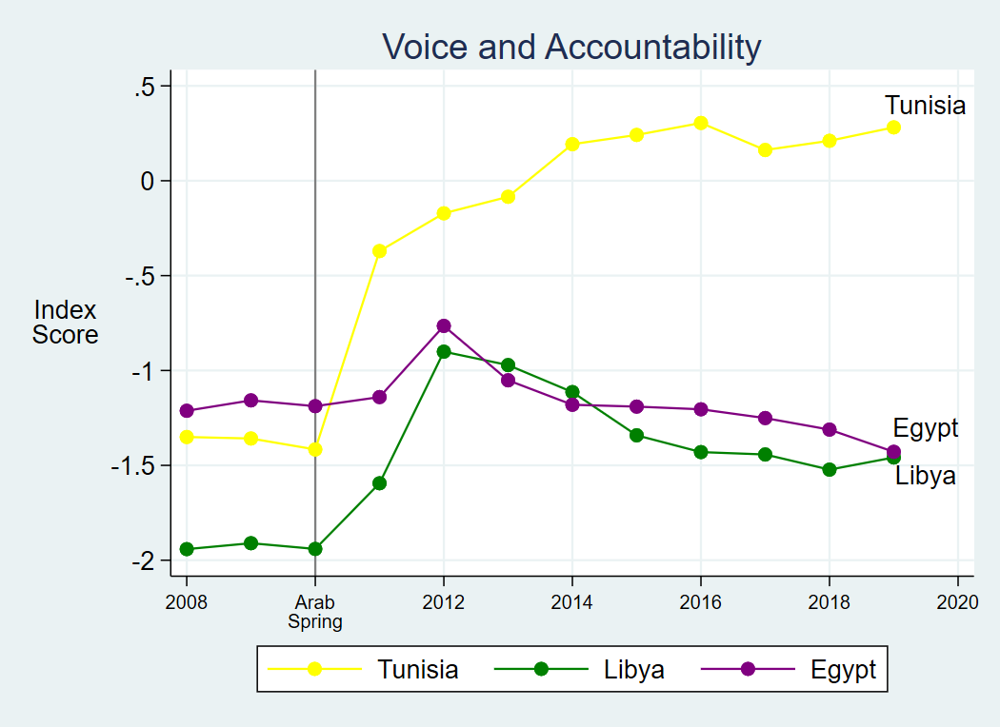

```{r setup, include=FALSE}
options(htmltools.dir.version = FALSE)
knitr::opts_chunk$set(
  fig.width=5, fig.height=3, fig.retina=3,
  out.width = "80%",
  cache = FALSE,
  echo = TRUE,
  message = FALSE, 
  warning = FALSE,
  fig.show = TRUE,
  hiline = TRUE
)
```

```{r xaringan-themer, include=FALSE, warning=FALSE}
library(xaringanthemer)
style_mono_light(
  base_color = "#23395b"
)

```

```{r include=F}
library(xaringanExtra)
library(tidyverse)
library(here)
library(readxl)
library(viridis)
library(knitr)

use_panelset()

#source(here("prep.r"))

```
### Session objective

Show finished visualization in R

Narrate construction of visualization step by step (coding out loud)

Compare / contrast against figure construction in Stata

---

### Visualization using a grammar of graphics

The ggplot2 package is based on a specific grammar of graphics. Under this grammar of graphics, a visualization comprises six layers: 

- data
- mapping (aesthetic)
- geometry
- facet
- statistic
- theme

---

### Template of a data visualization

All plots require the first three layers:

- data to visualize
- a mapping of variables from the data to the visualization grid
  - different types of mappings are referred to as 'aesthetics'
- a geometry that gives a specific implementation of the specified aesthetic

```{r eval = F}
ggplot(data = [DATASET],
       mapping = aes(x = [X VARIABLE],
                     y = [Y VARIABLE])) +
  geom_SOMETHING() 
```

---

### Example: Governance trends before and after the Arab Spring

.panelset[

.panel[.panel-name[Raw data]

```{r echo=F}
va <- read_excel("cleaned.xlsx", sheet = "VoiceandAccountability")
kable(va[c(1:3, 6:8), c(1, 3:8)])
```
Let's plot the World Bank Voice and Accountability index for each country, across years

]

.panel[.panel-name[Prepared data]
.pull-left[
```{r data-0.1, results="hide"}
va1 <- va %>%
  filter(Subindicator_Type == "Estimate") %>%
  pivot_longer(!Country_Name &
                 !Indicator_Id &
                 !Indicator &
                 !Subindicator_Type, 
               names_to = "Year", 
               values_to = "Estimate") %>%
  select(1,5,6) %>%
  filter(Year > 2007,
         Country_Name == "Egypt"|
           Country_Name == "Tunisia"|
           Country_Name == "Libya") %>%
  mutate(Year=as.numeric(Year)) %>%
  arrange(Year) %>%
  as.data.frame()
kable(va1)
```
]
.pull-right[
```{r ref.label = "data-0.1", echo=F}
```
]
]

.panel[.panel-name[Finished plot]

```{r out.width="60%"}
include_graphics("Voice and Accountability - R.png")
```
]
]

---

class: middle

# Coding out loud

- data
- mapping (aesthetic)
- geometry
- facet
- statistic
- theme

---

.midi[
> 1. **Start with the data**
]
.pull-left[
```{r data-0, fig.show = "hide", warning = FALSE}
ggplot(data = va1) #<<
```
]
.pull-right[
```{r ref.label = "data-0", echo = FALSE, warning = FALSE, out.width = "100%", fig.width = 8}
```
]

---

.midi[
> 1. Start with the data,
> 2. **map year to the x-axis**
]
.pull-left[
```{r data-1, fig.show = "hide", warning = FALSE}
ggplot(data = va1,
       mapping = aes(x = Year)) #<<
```
]
.pull-right[
```{r ref.label = "data-1", echo = FALSE, warning = FALSE, out.width = "100%", fig.width = 8}
```
]

---

.midi[
> 1. Start with the data,
> 2. map year to the x-axis
> 3. **map Voice and Accountability Index to y-axis**
]
.pull-left[
```{r data-2, fig.show = "hide", warning = FALSE}
ggplot(data = va1,
       mapping = aes(x = Year,
                     y = Estimate)) #<<
```
]
.pull-right[
```{r ref.label = "data-2", echo = FALSE, warning = FALSE, out.width = "100%", fig.width = 8}
```
]

---

.midi[
> 1. Start with the data,
> 2. map year to the x-axis
> 3. map Voice and Accountability Index to y-axis
> 4. **map Country to the color aesthetic**
]
.pull-left[
```{r data-3, fig.show = "hide", warning = FALSE}
ggplot(data = va1,
       mapping = aes(x = Year,
                     y = Estimate, 
                     color = Country_Name)) #<<
```
]
.pull-right[
```{r ref.label = "data-3", echo = FALSE, warning = FALSE, out.width = "100%", fig.width = 8}
```
]

---

.midi[
> 1. Start with the data,
> 2. map year to the x-axis
> 3. map Voice and Accountability Index to y-axis
> 4. map Country to the color aesthetic
> 5. **assign a point geometry to display the data mapping**
]
.pull-left[
```{r data-4, fig.show = "hide", warning = FALSE}
ggplot(data = va1,
       mapping = aes(x = Year, 
                     y = Estimate, 
                     color = Country_Name)) + 
                     geom_point(size=3) #<<
```
]
.pull-right[
```{r ref.label = "data-4", echo = FALSE, warning = FALSE, out.width = "100%", fig.width = 8}
```
]

---

.midi[
> 1. Start with the data,
> 2. map year to the x-axis
> 3. map Voice and Accountability Index to y-axis
> 4. map Country to the color aesthetic
> 5. assign a point geometry to display the data mapping
> 6. **assign a line geometry to display the data mapping**
]
.pull-left[
```{r data-5, fig.show = "hide", warning = FALSE}
ggplot(data = va1,
       mapping = aes(x = Year, 
                     y = Estimate, 
                     color = Country_Name)) + 
       geom_point(size=3) +
       geom_line(size=1) #<<
```
]
.pull-right[
```{r ref.label = "data-5", echo = FALSE, warning = FALSE, out.width = "100%", fig.width = 8}
```
]

---

.midi[
> 1. Start with the data,
> 2. map year to the x-axis
> 3. map Voice and Accountability Index to y-axis
> 4. map Country to the color aesthetic
> 5. assign a point geometry to display the data mapping
> 6. assign a line geometry to display the data mapping
> 7. **assign a color blind-friendly palette**
]
.pull-left[
```{r data-6, fig.show = "hide", warning = FALSE}
ggplot(data = va1,
       mapping = aes(x = Year, 
                     y = Estimate,
                     color = Country_Name)) + 
       geom_point(size=3) +
       geom_line(size=1) +
       scale_color_viridis_d() #<<
```
]
.pull-right[
```{r ref.label = "data-6", echo = FALSE, warning = FALSE, out.width = "100%", fig.width = 8}
```
]

---

.midi[
> 1. Start with the data,
> 2. map year to the x-axis
> 3. map Voice and Accountability Index to y-axis
> 4. map Country to the color aesthetic
> 5. assign a point geometry to display the data mapping
> 6. assign a line geometry to display the data mapping
> 7. assign a color blind-friendly palette
> 8. **highlight a break in the timeline with a vertical line**
]
.pull-left[
```{r data-7, fig.show = "hide", warning = FALSE}
ggplot(data = va1,
       mapping = aes(x = Year, 
                     y = Estimate,
                     color = Country_Name)) + 
       geom_vline(xintercept=2010, #<<
                  size=1.2, #<<
                  color="darkgrey", #<<
                  alpha=.8) + #<< add transparency
       geom_point(size=2) +
       geom_line(size=1) +
       scale_color_viridis_d()
```
Pop quiz: Why was the new code snippet inserted above the geometries? 
]
.pull-right[
```{r ref.label = "data-7", echo = FALSE, warning = FALSE, out.width = "100%", fig.width = 8}
```
]

---

.midi[
> 1. Start with the data,
> 2. map year to the x-axis
> 3. map Voice and Accountability Index to y-axis
> 4. map Country to the color aesthetic
> 5. assign a point geometry to display the data mapping
> 6. assign a line geometry to display the data mapping
> 7. assign a color blind-friendly palette
> 8. highlight a break in the timeline with a vertical line
> 9. **format the x-axis**
]
.pull-left[
```{r data-8, fig.show = "hide", warning = FALSE}
ggplot(data = va1,
       mapping = aes(x = Year, 
                     y = Estimate,
                     color = Country_Name)) + 
       geom_vline(xintercept=2010, 
                  size=1.2, 
                  color="darkgrey",
                  alpha=.8) +
       geom_point(size=3) +
       geom_line(size=1) +
       scale_color_viridis_d() +
       scale_x_continuous(limits=c(2008,2019), #<<
                          breaks=seq(2008,2018,2), #<<
                          labels=c("2008", "Arab\nSpring", "2012", "2014", "2016", "2018")) #<<
```
]
.pull-right[
```{r ref.label = "data-8", echo = FALSE, warning = FALSE, out.width = "100%", fig.width = 8}
```
]

---

.midi[
> 1. Start with the data,
> 2. map year to the x-axis
> 3. map Voice and Accountability Index to y-axis
> 4. map Country to the color aesthetic
> 5. assign a point geometry to display the data mapping
> 6. assign a line geometry to display the data mapping
> 7. assign a color blind-friendly palette
> 8. highlight a break in the timeline with a vertical line
> 9. format the x-axis
> 10. **format the y-axis**
]
.pull-left[
```{r data-9, fig.show = "hide", warning = FALSE}
ggplot(data = va1,
       mapping = aes(x = Year, 
                     y = Estimate, 
                     color=Country_Name)) + 
       geom_point(size=3) +
       geom_line(size=1) +
       scale_color_viridis_d() +
       scale_x_continuous(limits=c(2008,2019),
                     breaks=seq(2008,2018,2),
                     labels=c("2008", "Arab\nSpring", "2012", "2014", "2016", "2018")) +
       scale_y_continuous(limits=c(-2.0,0.5), #<<
                     breaks=seq(-2.0,1,0.5)) #<<
```
]
.pull-right[
```{r ref.label = "data-9", echo = FALSE, warning = FALSE, out.width = "100%", fig.width = 8}
```
]

---

.midi[
.pull-left[
> 1. Start with the data,
> 2. map year to the x-axis
> 3. map Voice and Accountability Index to y-axis
> 4. map Country to the color aesthetic
> 5. assign a point geometry to display the data mapping
> 6. assign a line geometry to display the data mapping
> 7. assign a color blind-friendly palette
> 8. highlight a break in the timeline with a vertical line
> 9. format the x-axis
> 10. format the y-axis
> 11. **add end-point labels**
]
]
.pull-right[
```{r data-10, fig.show = "hide", include=T, results="hide", warning = FALSE}
va_name <- va1 %>%
  group_by(Country_Name) %>%
  summarise(value1 = last(Estimate),
            value2 = nth(Estimate,11)) %>%
  mutate(value3 = c(-1.25, -1.55, .281),
         color=viridis(3))
va_name
```

```{r ref.label = "data-10", echo = FALSE, warning = FALSE, out.width = "100%", fig.width = 8}
```
]

---

.midi[
.pull-left[
> 1. Start with the data,
> 2. map year to the x-axis
> 3. map Voice and Accountability Index to y-axis
> 4. map Country to the color aesthetic
> 5. assign a point geometry to display the data mapping
> 6. assign a line geometry to display the data mapping
> 7. assign a color blind-friendly palette
> 8. highlight a break in the timeline with a vertical line
> 9. format the x-axis
> 10. format the y-axis
> 11. **add end-point labels**
```{r, fig.show = "hide", warning = FALSE}
ggplot(data = va1,
       mapping = aes(x = Year, y = Estimate, color=Country_Name, group=Country_Name)) + 
       geom_vline(xintercept=2010, 
                  size=1.2, 
                  color="darkgrey",
                  alpha=.8) +
       geom_point(size=3) +
       geom_line(size=1) +
       scale_color_viridis_d() # + 
```

```{r data-11, fig.show = "hide", echo=F, warning = FALSE}
ggplot(data = va1,
       mapping = aes(x = Year, y = Estimate, color=Country_Name, group=Country_Name)) + 
       geom_vline(xintercept=2010, 
                  size=1.2, 
                  color="darkgrey",
                  alpha=.8) +
       geom_point(size=3) +
       geom_line(size=1) +
       scale_color_viridis_d() +
       scale_x_continuous(limits=c(2008,2019),
                     breaks=seq(2008,2018,2),
                     labels=c("2008", "Arab\nSpring", "2012", "2014", "2016", "2018")) +
       scale_y_continuous(limits=c(-2.0,0.5),
                     breaks=seq(-2.0,1,0.5),
                     sec.axis=sec_axis(~., #<<
                     breaks=va_name$value3, #<<
                     labels=va_name$Country_Name)) #<<
```
]
.pull-right[
```{r echo=T, warning = FALSE}
# continued from left column
#       scale_x_continuous(limits=c(2008,2019),
#                     breaks=seq(2008,2018,2),
#                     labels=c("2008", "Arab\nSpring", "2012", "2014", "2016", "2018")) +
#       scale_y_continuous(limits=c(-2.0,0.5),
#                     breaks=seq(-2.0,1,0.5),
#                     sec.axis=sec_axis(~., #<<
#                     breaks=va_name$value3, #<<
#                     labels=va_name$Country_Name)) #<<
```

```{r ref.label = "data-11", echo = FALSE, warning = FALSE, out.width = "100%", fig.width = 8}
```
]
]

---
.pull-left[
> 1.  Start with the data,
> 2.  map year to the x-axis
> 3.  map Voice and Accountability Index to y-axis
> 4. map Country to the color aesthetic
> 5.  assign a point geometry to display the data mapping
> 6.  assign a line geometry to display the data mapping
> 7.  assign a color blind-friendly palette
> 8.  highlight a break in the timeline with a vertical line
> 9.  format the x-axis
> 10.  format the y-axis
> 11. add end-point labels
> 12. **remove legend**
]
.pull-right[
``` {r data-12, fig.show="hide", echo=T, warning=F}
ggplot(data = va1,
       mapping = aes(x = Year, y = Estimate, color=Country_Name, group=Country_Name)) + 
       geom_vline(xintercept=2010, size=1.2, color="darkgrey", alpha=.8) +
       geom_point(size=3) +
       geom_line(size=1) +
       scale_color_viridis_d() +
       scale_x_continuous(limits=c(2008,2019),
                     breaks=seq(2008,2018,2),
                     labels=c("2008", "Arab\nSpring", "2012", "2014", "2016", "2018")) +
       scale_y_continuous(limits=c(-2.0,0.5),
                     breaks=seq(-2.0,1,0.5),
                     sec.axis=sec_axis(~., 
                     breaks=va_name$value3, 
                     labels=va_name$Country_Name)) +
       theme(legend.position="NULL") #<<
```

```{r ref.label = "data-12", echo = FALSE, warning = FALSE, out.width = "100%", fig.width = 8}
```
]
---
.pull-left[
> 1.  Start with the data,
> 2.  map year to the x-axis
> 3.  map Voice and Accountability Index to y-axis
> 4.  map Country to the color aesthetic
> 5.  assign a point geometry to display the data mapping
> 6.  assign a line geometry to display the data mapping
> 7.  assign a color blind-friendly palette
> 8.  highlight a break in the timeline with a vertical line
> 9.  format the x-axis
> 10. format the y-axis
> 11. add end-point labels
> 12. remove legend
> 13. **apply a thematic style**
]
.pull-right[
```{r, fig.show = "hide", warning = FALSE}

base <- theme_bw() + 
  theme(panel.grid.minor.x=element_blank(),
        panel.grid.minor.y=element_blank(),
        plot.title=element_text(face="bold",size=18, hjust=.5, family = "Source Sans Pro"),
        plot.subtitle = element_text(size=16, family="Source Sans Pro"),
        plot.caption=element_text(size=12, family="Source Sans Pro"),
        axis.title=element_text(size=16, family="Source Sans Pro"),
        axis.text=element_text(size=14, family="Source Sans Pro"),
        legend.text=element_text(size=14, family="Source Sans Pro"),
        strip.text=element_text(size=14, family="Source Sans Pro"),
        panel.border=element_blank(),
        axis.ticks = element_blank())

```
]

---

.pull-left[
> 1.  Start with the data,
> 2.  map year to the x-axis
> 3.  map Voice and Accountability Index to y-axis
> 4.  map Country to the color aesthetic
> 5.  assign a point geometry to display the data mapping
> 6.  assign a line geometry to display the data mapping
> 7.  assign a color blind-friendly palette
> 8.  highlight a break in the timeline with a vertical line
> 9.  format the x-axis
> 10.  format the y-axis
> 11. add end-point labels
> 12. remove legend
> 13. **apply a thematic style**

Pop quiz: why is the theme function placed after calling the base object?
]

.pull-right[
```{r data-13, fig.show = "hide", warning = FALSE}

ggplot(data = va1,
       mapping = aes(x = Year, y = Estimate, color=Country_Name, group=Country_Name)) + 
  geom_vline(xintercept=2010, size=1.2, color="darkgrey", alpha=.8) +
  geom_point(size=3) +
  geom_line(size=1) +
  scale_color_viridis_d() +
  scale_x_continuous(limits=c(2008,2019),
                     breaks=seq(2008,2018,2),
                     labels=c("2008", "Arab\nSpring", "2012", "2014", "2016", "2018")) +
  scale_y_continuous(limits=c(-2.0,0.5),
                     breaks=seq(-2.0,1,0.5),
                     sec.axis=sec_axis(~.,
                                       breaks=va_name$value3,
                                       labels=va_name$Country_Name)) +
  base + #<<
  theme(legend.position="NULL") 
```
]

---

.pull-left[
> 1.  Start with the data,
> 2.  map year to the x-axis
> 3.  map Voice and Accountability Index to y-axis
> 4.  map Country to the color aesthetic
> 5.  assign a point geometry to display the data mapping
> 6.  assign a line geometry to display the data mapping
> 7.  assign a color blind-friendly palette
> 8.  highlight a break in the timeline with a vertical line
> 9.  format the x-axis
> 10. format the y-axis
> 11. add end-point labels
> 12. remove legend
> 13. **apply a thematic style**
]

.pull-right[
```{r ref.label = "data-13", echo = FALSE, warning = FALSE, out.width = "100%", fig.width = 8}
```
]

---

.pull-left[
> 1.  Start with the data,
> 2.  map year to the x-axis
> 3.  map Voice and Accountability Index to y-axis
> 4.  map Country to the color aesthetic
> 5.  assign a point geometry to display the data mapping
> 6.  assign a line geometry to display the data mapping
> 7.  assign a color blind-friendly palette
> 8.  highlight a break in the timeline with a vertical line
> 9.  format the x-axis
> 10. format the y-axis
> 11. add end-point labels
> 12. remove legend
> 13. apply a thematic style
> 14. **remove axis labels, add title and caption**
]

.pull-right[
```{r data-14, fig.show = "hide", warning = FALSE}

ggplot(data = va1,
       mapping = aes(x = Year, y = Estimate, color=Country_Name, group=Country_Name)) + 
  geom_vline(xintercept=2010, size=1.2, color="darkgrey", alpha=.8) +
  geom_point(size=3) +
  geom_line(size=1) +
  scale_color_viridis_d() +
  scale_x_continuous(limits=c(2008,2019), breaks=seq(2008,2018,2), labels=c("2008", "Arab\nSpring", "2012", "2014", "2016", "2018")) +
  scale_y_continuous(limits=c(-2.0,0.5), breaks=seq(-2.0,1,0.5), sec.axis=sec_axis(~., breaks=va_name$value3, labels=va_name$Country_Name)) +
  base + 
  theme(legend.position="NULL") +
  labs(x="",
       y="",
       title="Voice and Accountability",
       caption="Voice and Accountability ranges from -2.5 (weak) to 2.5 (strong)")
```

```{r ref.label = "data-14", echo = FALSE, warning = FALSE, out.width = "100%", fig.width = 8}
```

]

---

### Final products

.pull-left[

Stata (see separate documentation for tutorial content)

```{r echo=F}

```
]
.pull-right[

R

```{r echo=F}
include_graphics("Voice and Accountability - R.png")
```
]

---

class: center, middle

# Thank you!

