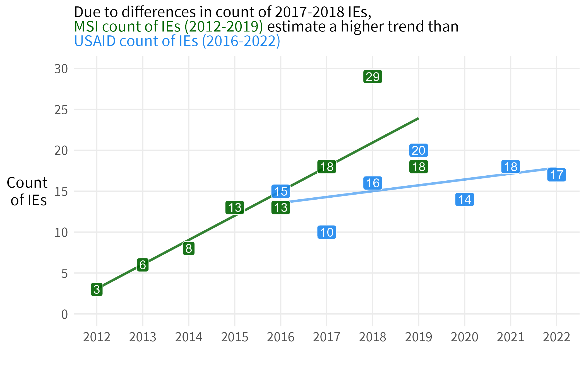

```{r setup, include=FALSE, echo=F}
library(tufte)
library(knitr)
# invalidate cache when the tufte version changes
knitr::opts_chunk$set(cache.extra = packageVersion('tufte'))
options(htmltools.dir.version = FALSE)
```

`r newthought('USAID count of evaluations 2016-2022')`

```{r echo=F}
include_graphics("ie pe trends 2016-2022 fill.png")
```

`r newthought('Compare to MSI inventory in 2020')`

```{r echo=F}

```

`r newthought('MSI assessment of IE quality 2012-2019')`

Proportion of USAID IEs meeting quality benchmark, per year (MSI 2020)

```{r echo=F}
include_graphics("ie quality over time (MSI 2020).png")
```


