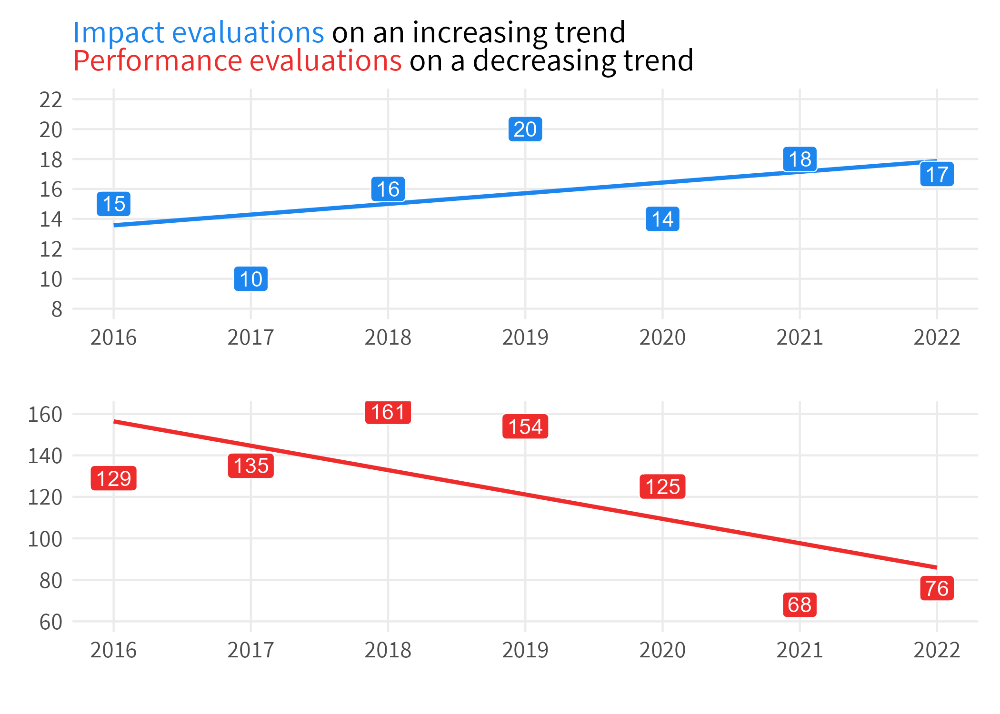
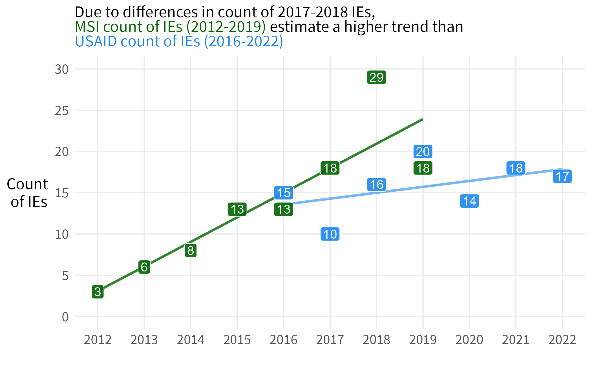
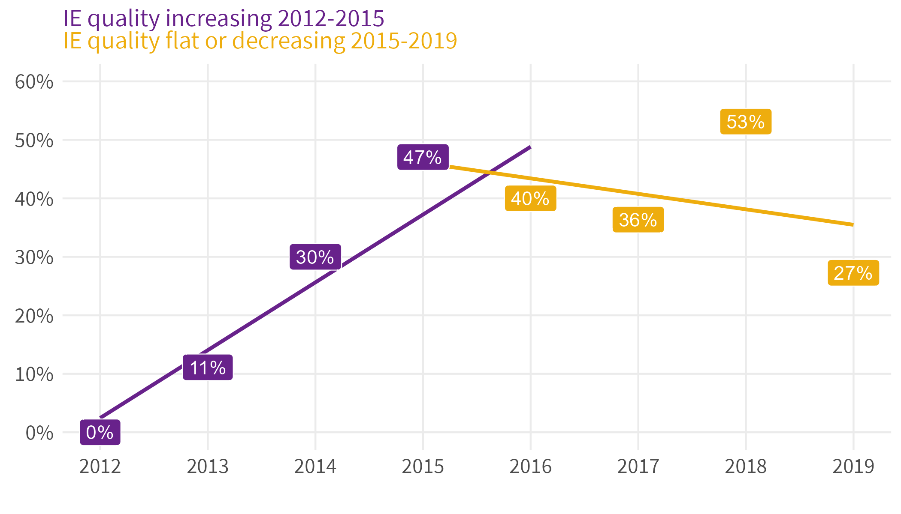

```{r setup, include=FALSE}
options(htmltools.dir.version = FALSE)

source("../misc/prep.r")
library(knitr)

```


---
class: center, middle

# USAID count of evaluations 2016-2022

```{r}



```


---
class: inverse, center, middle

# Compare to MSI inventory in 2020

```{r}

```


---

# 

```{r}

```


